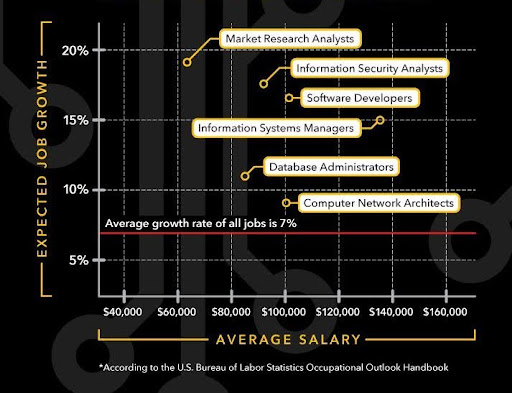

<!-- markdownlint-disable MD033 -->
<!DOCTYPE html>
<html lang="en">
<head>
    <meta charset="UTF-8">
    <title>UMBC COEIT Copy/Paste Tool</title>
    
</head>
<body>
    

        

            <h2>CLAUSE SELECTOR</h2>
            
Select the clauses you want to include in your document.

            

                

                    <input type="checkbox" id="Introduction Paragraph C/P" class="clause-checkbox" value="<h3>Introduction Paragraph C/P</h3>
, many of the courses you have completed thus far will count towards the completion of the (insert program here) program at UMBC. On the pages above, you will see courses highlighted and on the second page courses listed in green or black font. The courses listed in green and highlighted in bright yellow are courses that you have already completed, the light yellow are courses in progress, and the courses in black are those which still need to be completed. Please note, these recommendations are based on current course equivalencies. Additionally, please keep in mind that this is an unofficial evaluation of the credits you have completed thus far. An official evaluation will be completed upon your admittance to the university. On the unofficial evaluation, courses listed in red are UMBC course equivalents. If a course is in parentheses, it will not be applied towards your degree requirements at UMBC.

On the pages above, you will see courses which have been highlighted. These highlighted courses are courses that you have already completed, whether at UMBC or another institution. If a course is in parenthesis, it will not be applied towards your degree requirements at UMBC.
">
                    <label for="Introduction Paragraph C/P">Introduction Paragraph C/P</label>
                

                

                    <input type="checkbox" id="Course Recommendations Paragraph C/P" class="clause-checkbox" value="<h3>Course Recommendations Paragraph C/P</h3>
When planning to transfer, I generally recommend taking courses required for the first two years of the program you are interested in. On the page above, you will find UMBC courses on the left, and their community college equivalents on the right. I recommend working on classes listed in black such as:

As you continue to take courses, please keep in mind that grades of C or higher are required for any major course to apply towards a bachelor's degree at UMBC. Courses for which grades of D are earned will not count towards any major requirement.

Or

As you take courses, please keep in mind that grades of C or higher are required for any course to apply towards a bachelor's degree at UMBC. This policy excludes the gateway requirements for which higher grades are required. More information about the gateway requirements can be found below.
">
                    <label for="Course Recommendations Paragraph C/P">Course Recommendations Paragraph C/P</label>
                

                

                    <input type="checkbox" id="Repeat Policy Blurb" class="clause-checkbox" value="<h3>COEIT Repeat Policy</h3>
Please also keep in mind that our college has a strict course repeat policy and students are only allowed two attempts in any course required for the major or required to progress in the major. This means for any Math, Science, or major related class, a student has only two attempts to earn the required grade. This policy includes transfer credits and courses for which grades of W have been given.
">
                    <label for="Repeat Policy Blurb">Repeat Policy Blurb</label>
                

                

                    <input type="checkbox" id="Language Requirement Blurb" class="clause-checkbox" value="<h3>Language Requirement Blurb</h3>
Another requirement that you can continue to work on while at (Insert CC) is your language requirement. If you have completed 4 years of a language in high school, you can submit your transcript to have the requirement waived. Otherwise, in order to complete your language requirement at UMBC, you will need to take a language course to the intermediate level. There are a few other ways you can take care of your language requirement. I have included links on this requirement below but would be happy to discuss it further with you should you have more questions.
">
                    <label for="Language Requirement Blurb">Language Requirement Blurb</label>
                

                

                    <input type="checkbox" id="CSEE Track Blurb" class="clause-checkbox" value="<h3>CSEE Track Blurb</h3>
You are welcome to pursue any track for the computer science program that you may be interested in. Since you will choose your track once you have gotten to your 300-level courses, you will have plenty of time to make your decision. <a href='https://umbc.edu' target='_blank'>Track courses are 400-level computer science electives</a> that you take towards the end of your degree. These courses are indicated by CMSC 4XX above. More information on the tracks can be found below.
">
                    <label for="CSEE Track Blurb">CSEE Track Blurb</label>
                

                

                    <input type="checkbox" id="Last Paragraph" class="clause-checkbox" value="<h3>Last Paragraph</h3>
Below you will find information on the (Insert program) program as well as other information I think will be helpful as you plan your transfer. If you have any questions about anything on this document, please feel free to email COEITtransfer@umbc.edu.

UMBC has so much to offer. <a href='https://umbc.edu/undergraduate/life-at-umbc/' target'_blank'>Life on the UMBC Campus</a> can be whatever you make it.

Explore recent College of Engineering and Information Technology (COEIT) news highlights on <a href='https://coeit.umbc.edu/coeit-news-archive/' target='_blank'>the COEIT News Archives.</a>
">
                    <label for="Last Paragraph">Last Paragraph</label>
                

                

                    <input type="checkbox" id="GEP & University Requirements" class="clause-checkbox" value="<h3>General Education/University Requirement Information</h3><h4>University Degree Requirements:</h4><ul><li><b>Minimum Upper-level Credits:</b> Without exception, at least 45 of the minimum 120 credits required for graduation must be in UMBC courses numbered at the 300-level or above or their equivalents.</li><li><b>Minimum Resident Credits:</b> Without exception, students must complete at least 30 credits of coursework at UMBC (referred to as resident credit) to receive a UMBC degree. Of the 30 resident credits, 15 must be upper-level (courses numbered at the 300-level or above).</li><li><b>Writing Intensive Course (WI):</b> Without exception, students must complete one writing intensive course; a designated WI course may count for the major or a distribution requirement, or it may be taken as an elective. The WI course must be completed at UMBC; transfer courses may not be used to fulfill this requirement.</li><li><b>General Education Requirements:</b> To fulfill general education requirements, students will complete courses distributed across six broad areas of academic inquiry: English Composition (ENGL 100), Mathematics (1 course), Arts and Humanities (3 courses), Social Science (3 courses), Sciences (1 w/lab, 1 w/o lab), Language* and Culture (1 course for BS, 2 for BA)</li><ul><li>All courses used to satisfy general education requirements must be completed with a 'C' or better.</li><li>Courses taken on a P/F or S/U basis may not be applied to general education requirements.</li><li>No one course may be used to satisfy more than one area.</li><li>No more than three courses from the same discipline may be used throughout the general education program.</li></ul><li><b>Language Requirement:</b> The language requirement consists of completion of a foreign language through the 201 level or demonstrated proficiency at that level. Proficiency, the number of courses needed to complete the requirement, and course placement, are determined by previous experience as follows:</li><ul><li>completion of level 4 or higher of a language in high school (<a href='https://mlli.umbc.edu/l201-proficiency-and-high-school-language-levels/' target='_blank'>see table</a>) OR</li><li>corresponding AP, IB or CLEP credit (see Appendix II, <a href='https://catalog.umbc.edu/content.php?catoid=33&navoid=2301' target='_blank'>Undergraduate Catalog</a>), OR</li><li>completion of a language through the 201 level at a regionally accredited college/university</li></ul><li>For more information about the language requirement, you can visit the Department of Modern Languages, Linguistics, and Intercultural Communication (MLLI) page on <a href='https://mlli.umbc.edu/l201-proficiency-and-high-school-language-levels/' target='_blank'>201 Proficiency and High School Language Levels.</a></li><li>Students can receive the equivalency for 201 level proficiency to fulfill the GEP language requirement or the language component of the GDR, GER, or GFR by a) demonstrating successfully completed education in a second language or b) through examination. The equivalency application does not grant credits but rather recognizes completion of the L201 requirement.</li><li>1. International students and U.S. resident students proficient in a language other than English may receive equivalency for the 201-level proficiency requirement if they present documentation showing that: a) they attended a secondary school (i.e., sixth grade or above) in which the language of instruction was not only English, or b) they attended an English-speaking secondary school or a comprehensive bi or multi-lingual program accredited by a foreign government and have at least one year of successfully-completed education in a language other than English at that level.</li><li>You can check out the MLLI Policy on <a href='https://mlli.umbc.edu/l201-for-international-students/' target='_blank'>Foreign Language 201-level for international students and multi-lingual students</a> to determine your most accurate language placement.</li></ul>">
                    <label for="GEP & University Requirements">GEP & University Requirements</label>
                

                

                    <input type="checkbox" id="Extras" class="clause-checkbox" value="<b>
*: Gateway Course

SS & AH GEP: Social Science and Arts & Humanities General Education Program

*These course equivalencies are based on current evaluations from <a href='https://artsys.usmd.edu/' target='_blank'>ARTSYS</a> (2025)
</b>">
                

                

                    <input type="checkbox" id="BTA Overview" class="clause-checkbox" value="<h3>Business Technology Administration Overview</h3>
<a href='https://informationsystems.umbc.edu/home/undergraduate-programs/undergraduate-degree-programs/business-technology-administration/' target='_blank'>The Bachelor of Arts degree in Business Technology Administration</a> (BTA) program trains students for management positions in the growing job field of Information Systems. This major is housed within <a href='https://informationsystems.umbc.edu/' target='_blank'>UMBC’s Department of Information Systems</a>. It is an interdisciplinary program developing practical knowledge for the integration of computers, organizational processes, and people into effective and efficient systems. The BTA program is designed for students who want a grounding in the development and use of office systems and computer-based technologies found in business, government, and nonprofit organizations. The BA degree is less technical in nature than the BS program and the focus of the courses is on using IT of different types to solve problems that arise in a business setting. Through a variety of courses such as human resources management, project management, business law, ethics, and operations management, students learn the skills to be successful managers, analysts and, administrators in an Information Systems organization. In addition, BTA students experience working with companies on projects that analyze systems and research solutions for implementation in small and large enterprises.
<h4>Certificates</h4>
Whichever program you choose, we offer a wide variety of undergraduate certificates to supplement your interests. From web development to MBA prep, certificates can help you supercharge your education. Certificates can only be earned in conjunction with majoring in one of our undergraduate programs. View all of our <a href='https://informationsystems.umbc.edu/home/undergraduate-programs/certificate-programs/' target='_blank'>Certificate Programs</a>.
<h4>Accelerated Programs</h4>
Accelerated programs, also called BS/MS programs, enable students to add a Bachelors AND Masters degree to their resume with only one additional year of study (on average). This saves you time and money. Information on our combined programs can be found <a href='https://informationsystems.umbc.edu/home/undergraduate-programs/undergraduate-degree-programs/accelerated-programs/' target='_blank'>here</a>.
<h4>Scholarships</h4>
We believe IS students are among the best in the university, and we want to honor that high achievement. We offer several scholarships specifically for students studying Information Systems. Visit our <a href='https://informationsystems.umbc.edu/home/undergraduate-programs/academic-honors-scholarships-and-resources/' target='_blank'>Scholarships page to learn more</a>.
<h4>Research Opportunities</h4>
UMBC is one of the few universities committed to undergraduate research, and the IS Department takes this mission seriously. For students interested in pursuing research, we have five main research areas: Artificial Intelligence and Knowledge Management, Data Science, Health Informatics, Human-Centered Computing, and Software Engineering. Check out our <a href='https://informationsystems.umbc.edu/home/undergraduate-programs/undergraduate-research-opportunities/' target='_blank'>Undergraduate Research Opportunities</a>.
">
                    <label for="BTA Overview">BTA Overview</label>
                

                

                    <input type="checkbox" id="Computer Engineering Overview" class="clause-checkbox" value="<h3>Computer Engineering Overview</h3>
The <a href='https://www.csee.umbc.edu/undergraduate/computer-engineering-bs/' target='_blank'>Computer Engineering B.S. degree</a> is housed within <a href='https://www.csee.umbc.edu/' target='_blank'>UMBC’s Department of Computer Science and Electrical Engineering</a> and is an <a href='https://www.csee.umbc.edu/undergraduate/computer-engineering-bs/student-outcomes/' target='_blank'>ABET Accredited program</a>. Computer engineering focuses on problems that arise from hardware and hardware development, whereas computer science concentrates on issues in computer applications and software development. Computer Engineering is a field that combines training in classical Electrical Engineering disciplines with in-depth preparation in Computer Science topics. The result is a trained problem solver who understands both the hardware and software aspects of computers and who can design and implement solutions on both sides of the hardware/software interface. Computer engineers are employed across the wide range of growing industries associated with communications, control, and signal processing and microelectronic fabrication. Our program provides students with challenging hands-on experiences through a broad and rigorous curriculum that includes exposure to multiple programming languages and development tools in their software courses, practical labs featuring up-to-date equipment in their hardware courses, and coverage of such advanced areas as embedded systems design, digital signal processing, and software engineering. Areas of interest to computer engineers range from circuit theory and digital signal processing to the study of software/hardware interfaces to the design and analysis of hardware systems and devices. Emphasis is placed on the development of problem-solving skills through hands-on laboratory experience with commercial electronic design software and hardware systems. All students participate in a senior-year Capstone project that culminates their training.

The Computer Engineering degree offers three tracks: Electronic Systems, Communications, and Cybersecurity. The Electronic Systems track focuses on large electronic systems and networks. The Communications track focuses on computer and electrical communications networks. The Cybersecurity track emphasizes security of computer systems, along with in depth design of computer hardware topics closely related to the Electronic Systems Track.
<h4>Gateway Courses for Computer Engineering:</h4>
CMSC 201, MATH 151, PHYS 121 (or 122), CMPE 212 with a grade of 'B' or better and ENES 101 with a grade of 'C' or better. Enrolling in a gateway course at UMBC or a Computer Engineering Department equivalent course at another institution is considered an attempt.
<h4>Repeat Policy:</h4>
Computer Engineering majors are permitted two attempts in courses required for the major. A course in which the student receives a grade of 'W' (Withdraw) is counted as an attempt. Please note that you will not be permitted a third attempt in required courses taken at UMBC or another institution. Students who have more than two attempts in any course required to progress in the major will not be permitted to major in Computer Engineering. This policy is applicable to transfer students.
<h4>Required Technology</h4>
Starting Fall 2020, all students are required to follow the <a href='https://www.csee.umbc.edu/undergraduate/required-technology/' target='_blank'>laptop requirement</a>. Incoming students should follow Fall and Spring semester requirements each academic year. Laptops with a webcam are required or a separate webcam, for laptops without inbuilt one, is required.
<h4>Combined BS/MS Program</h4>
Students who see Graduate School in their future can choose to enroll in the combined B.S./ M.S. program, which will allow them to speedily complete a B.S. in Computer Engineering and an M.S. in Computer Engineering OR Electrical Engineering. For information about requirements and guidelines, <a href='https://www.csee.umbc.edu/undergraduate/computer-engineering-bs/combined-bsms/' target='_blank'>go here</a>.
">
                    <label for="CMPE Overview">Computer Engineering (CMPE) Overview & Policies</label>
                

                

                    <input type="checkbox" id="CMSC Overview" class="clause-checkbox" value="<h3>Computer Science Overview</h3>
The <a href='https://www.csee.umbc.edu/undergraduate/computer-science-bs/' target='_blank'>B.S. in Computer Science</a> is housed within UMBC’s <a href='https://www.csee.umbc.edu/undergraduate/computer-science-bs/' target='_blank'>Department of Computer Science and Electrical Engineering</a>. Computer Science concentrates on issues in computer applications and software development. UMBC’s B.S. in Computer Science, <a href='https://www.csee.umbc.edu/undergraduate/computer-science-bs/student-outcomes/' target='_blank'>an ABET accredited program</a>, introduces students to a rich and diverse discipline. Opportunities in the exciting emerging fields such as artificial intelligence, machine learning, cybersecurity, malware analysis, mobile computing, graphics, game design, quantum computing, human-computer interaction, forensic analysis, and data science are accessible in a wide range of environments. UMBC computer science graduates are employed by varied businesses: tech industry leaders, government agencies, the defense industry, and video game design companies. Other major employers include financial technology, transportation, and a variety of other startups.

Graduates of the computer science program are well prepared for advanced studies and for problem-solving across the breadth of the discipline: theory, design, architecture, development and application of computers and computer systems. Many go on to graduate school in top Computer Science and Computer Engineering departments. Career paths include software engineers, database administrators, network architects, computer programmers, web developers and information security analysts.
<h4>Computer Science Gateway courses:</h4>
CMSC 201, CMSC 202, and CMSC 203 with grades of B or higher in CMSC 201 and CMSC 202, and a grade of C or higher in CMSC 203. Grades of C or higher are required for any course required for the computer science major program.
<h4>Repeat Policy:</h4>
Computer Science majors are permitted two attempts in courses required for the major. They are considered registered for a course if they are enrolled after the end of the schedule adjustment period. A course in which the student receives a grade of 'W' (Withdraw) is counted as an attempt. Please note that you will not be permitted a third attempt in required courses taken at UMBC or another institution. Students who have more than two attempts in any course required to progress in the major will not be permitted to major in Computer Science. This policy is applicable to transfer students.

Students who are accepted into the University having already met the Gateway requirements for their major will remain a Pre-Major until all transcripts with final grades have been received, posted by the Registrar’s Office, and processed by the College of Engineering and Information Technology. Typically, this will happen after the first semester of enrollment at UMBC.
<h4>CMSC Science Requirement:</h4>
Science sequence plus a lab (sequence of BIO141/BIO142 or CHEM101/CHEM102 or PHYS121/PHYS122 + one lab science to include SCI101L or CHEM102L or PHYS122L or GES286). Additionally, students who transfer in a science course with a laboratory component will have met the laboratory portion of this requirement so long as the transferred science course is intended for science and/or engineering majors. This includes courses where the laboratory components are transferred without additional credits.
<h4>CMSC Tracks:</h4><ul><li><a href='https://www.csee.umbc.edu/undergraduate/cmsc-cybersecurity-track/' target='_blank'>CYBR: Cybersecurity track</a></li><li><a href='https://www.csee.umbc.edu/undergraduate/cmsc-data-science-track/' target='_blank'>DSCI: Data Science track</a></li><li><a href='https://www.csee.umbc.edu/undergraduate/cmsc-game-development-track/' target='_blank'>GDEV: Game development track</a></li><li><a href='https://advising.coeit.umbc.edu/computer-science-artificial-intelligence-machine-learning-track-required-courses/' target='_blank'>AI/ML: Artificial Intelligence/ Machine Learning Track</a></li></ul>
Additional information on the Computer Science track requirements can be found <a href='https://www.csee.umbc.edu/computer-science-b-s-tracks/' target='_blank'>here</a>.
<h4><a href='https://www.csee.umbc.edu/undergraduate/required-technology/' target='_blank'>Required Technology</a></h4>
Starting Fall 2020, all students are required to follow the laptop requirement. Incoming students should follow Fall and Spring semester requirements each academic year. Current Laptop recommendations can be found <a href='https://www.csee.umbc.edu/undergraduate/required-technology/' target='_blank'>here</a>.
">
                    <label for="CMSC Overview">Computer Science (CMSC) Overview & Policies</label>
                

                

                    <input type="checkbox" id="ENCH Overview" class="clause-checkbox" value="<h3>Chemical Engineering Overview</h3>
The <a href='https://cbee.umbc.edu/' target='_blank'>Department of Chemical and Biochemical Engineering</a> offers an undergraduate program leading to a <a href='https://cbee.umbc.edu/academics/degree-programs/ench/' target='_blank'>Bachelor of Science in Chemical Engineering</a>. Chemical engineering students begin their studies by acquiring a good foundation in mathematics, physics and chemistry. Higher level courses cover the engineering, simulation and optimization of chemical processes, including the related economic principles.

 From creating new vaccines and antibiotics to cleaning up air and water pollution, chemical engineers develop manufacturing processes for a wide variety of applications, including food, pharmaceuticals, chemicals, biotechnology and environmental technology

Students have many opportunities to participate in faculty research. Recent student projects have explored the design of an antibody to target the protein that triggers Alzheimer's disease and the purification of a protein to control cell growth, with potential application for cancer treatment.

Chemical engineering graduates are prepared for graduate study or immediate industrial employment in fields such as chemical processing, food processing, metallurgy, energy conversion, petroleum refining and pharmaceutical production. Recent graduates of the department have obtained employment as chemical engineers at W.R. Grace, DuPont, Corning, Exxon, Rohm and Haas, Merck, FMC and International Paper.

The B.S. in Chemical Engineering, accredited by the Accreditation Board for Engineering and Technology (<a href='http://cbee.umbc.edu/academics/abet-accreditation/' target='_blank'>ABET</a>). All tracks lead to the B.S. in Chemical Engineering and require the same chemical engineering core classes, we offer three tracks allowing students to specialize in:
<ul><li><b><a href='https://cbee.umbc.edu/academics/prospective-undergrads/' target='_blank'>The Traditional Track</a></b> prepares students for graduate study or immediate industrial employment in such varied fields as chemical processing, food processing, metallurgy, energy conversion, petroleum refining and pharmaceutical production.</li><li><b><a href='https://cbee.umbc.edu/academics/prospective-undergrads/' target='_blank'>The Biotechnology and Bioengineering Track</a></b> integrates the life sciences into each year of the curriculum and is intended for students who are interested in working in the biotechnology industry, pursuing graduate work in biochemical or biomedical engineering or going to medical school.</li><li><b><a href='https://cbee.umbc.edu/academics/prospective-undergrads/' target='_blank'>The Environmental Engineering and Sustainability Track</a></b> stems from the traditional chemical engineering track and provides specialization in the application of basic chemical engineering principles in the field of environmental engineering such as cleaning up air and water pollution and managing chemical processes to minimize environmental impact.</li></ul>
The primary differences are in the science courses and technical electives that are taken. Your advisor can help you decide which track is right for you.

For a side-by-side comparison view the <a href='https://cbee.umbc.edu/academics/degree-programs/ench/curriculum/' target='_blank'>ENCH Undergraduate Curriculum chart</a>.
<h4>Chemical Engineering Gateway Requirements:</h4>
Students are admitted to the chemical engineering program only when they pass all four of the following Gateway courses: ENES 101, MATH 152, CHEM 102, and ENCH 215 with a grade of at least two B’s and two C’s.

* Enrolling in a gateway course at UMBC or a Chemical Engineering Department equivalent course at another institution is considered an attempt. Students must select a track to complete—Traditional, Biotechnology/Bioengineering or Environmental Engineering and Sustainability.
<h4>Repeat Policy:</h4>
Chemical Engineering majors are permitted two attempts in courses required for the major. They are considered registered for a course if they are enrolled after the end of the schedule adjustment period. A course in which the student receives a grade of 'W' (Withdraw) is counted as an attempt. Please note that you will not be permitted a third attempt in required courses taken at UMBC or another institution. Students who have more than two attempts in any course required to progress in the major will not be permitted to major in Chemical Engineering. This policy is applicable to transfer students.
<h4>CENG Technology Requirements</h4>
The Chemical, Biochemical and Environmental Engineering Department requires all incoming students to have their own laptop. Additional information can be found on the <a href='https://cbee.umbc.edu/academics/undergraduate-program-policies/#computer' target='_blank'>Undergraduate Program Policies</a> page, under the “Computer Requirements” section.
<h4><a href='https://cbee.umbc.edu/academics/degree-programs/bsms/'>Accelerated Program</a></h4>
UMBC’s <a href='https://accelerate.umbc.edu/' target='_blank'>Accelerated Program</a> makes it possible to double-count up to 12 credits towards both your undergraduate and graduate coursework. You’ll save money and time as you further your academic career. Students applying to the BSMS program are not required to take the GRE examination. Acceptance into the BSMS program does not bind you to completing a graduate degree at UMBC. Additional information on Chemical Engineering’s Accelerated Programs can be found <a href='https://cbee.umbc.edu/academics/degree-programs/bsms/' target='_blank'>here</a>.

View <a href='https://cbee.umbc.edu/academics/prospective-undergrads/testimonials/' target='_blank'>Testimonials</a> from current chemical engineering students
">
                    <label for="ENCH Overview">Chemical Engineering (ENCH) Overview & Policies</label>
                

                

                    <input type="checkbox" id="IS Overview" class="clause-checkbox" value="<h3>Information Systems (B.S.) Overview</h3>
The <a href='https://informationsystems.umbc.edu/home/undergraduate-programs/undergraduate-degree-programs/bachelor-of-science-in-information-systems/' target='_blank'>Bachelor of Science in Information Systems</a> gives students an in-depth technical education in computer information systems, and allows students to specialize through the choice of elective courses such as computer networking and health care informatics.The IS program prepares students for all potential career positions in the IS field such as: Systems Analysis and Design, Computer Networking and Health Care Informatics.

The IS department teaches students how to design, build and manage computer systems and to be knowledgeable users of them. Students take courses in disciplines such as mathematics and statistics, computer programming, management science, economics and technical writing as well as specific courses in computer information system analysis, design, construction and management.

Information systems students are encouraged to participate in internships or co-ops. Students gain practical work experience from companies such as Comcast Cable, the U.S. Census Bureau and the Naval Research Labs. Through the Information Systems Council of Majors, students have opportunities to attend professional meetings of computer-related societies.
<h4>Information Systems Gateway:</h4>
Before being allowed to take IS 410 and 450 (and then the rest of the IS 400-level core courses), a student must first complete the following gateway requirements:
<ul><li>A grade of 'C' or higher in:<ul><li>MATH 155 – Elementary Calculus</li><li>IS 147 – Introduction to Computer Programming</li></ul></li><li>And a grade of 'B' or higher in:<ul><li>IS 300 – Management Information Systems</li><li>IS 310 – Software and Hardware Concepts</li></ul></li></ul><h4><a href='https://informationsystems.umbc.edu/undergraduate/' target='_blank'>What is Information Systems?</a></h4>
The human side of computing. Information systems (IS) are everywhere, from the phone in your pocket to scientists studying the polar ice caps. At its core, IS focuses on the entire system of information, knowledge, delivery and use involved in computer technology.

 In our IS program, you will investigate the societal impact of technology, dealing with real and imminent challenges. With the help of our faculty members, you will study, design, develop, and evaluate information technologies to address the needs of a broad range of individuals and organizations.

 You will be able to leave UMBC with technical skills like programming, database management, and web design, as well as the business skills required to help you excel in your career.
<h4>The information systems department offers undergraduate certificates in</h4><ul><li><a href='http://informationsystems.umbc.edu/home/undergraduate-programs/undergraduate-upper-division-certificates/cybersecurity-informatics-certificate/' target='_blank'>Cybersecurity Informatics Certificate<a></li><li><a href='http://informationsystems.umbc.edu/home/undergraduate-programs/undergraduate-upper-division-certificates/health-it-certificate/' target='_blank'>Health IT Certificate</a></li><li><a href='http://informationsystems.umbc.edu/home/undergraduate-programs/undergraduate-upper-division-certificates/decision-making-support-certificate/' target='_blank'>Decision Making Support Certificate</a></li><li><a href='http://informationsystems.umbc.edu/home/undergraduate-programs/undergraduate-upper-division-certificates/network-administration-certificate/' target='_blank'>Network Administration Certificate</a></li><li><a href='http://informationsystems.umbc.edu/home/undergraduate-programs/undergraduate-upper-division-certificates/web-development-certificate/'>Web Development Certificate</a></li><li><a href='http://informationsystems.umbc.edu/home/undergraduate-programs/undergraduate-management-and-business-program/auditing-for-information-systems-certificate-ais/' target='_blank'>Certificate in Auditing for Information System</a></li></ul><h4>Research Opportunities</h4>
UMBC is one of the few universities committed to undergraduate research, and the IS Department takes this mission seriously. For students interested in pursuing research, we have five main research areas: Artificial Intelligence and Knowledge Management, Data Science, Health Informatics, Human-Centered Computing, and Software Engineering.

Check out our <a href='https://informationsystems.umbc.edu/home/undergraduate-programs/undergraduate-research-opportunities/' target='_blank'>Undergraduate Research Opportunities</a>.
<h4>Special Opportunities for Information Systems Students</h4>
UMBC has the largest cooperative education program in Maryland. The department encourages all students to participate in co-op or internship programs. Students have found the experience invaluable in helping them understand class concepts and in getting a job after graduation. All co-op and many internship programs are paid positions. Many may also be used toward college credits.

The IS Department is excited to share a new mentoring program for new IS transfer students! Please <a href='https://drive.google.com/file/d/1M3cUTzX2ucMRCklG-xbbof1dRV3zl04D/view?usp=sharing' target='_blank'>check out our flyer</a>, and use the information provided to contact us if you're interested in learning more.
<h4><a href='https://youtu.be/IXcteinVZKY' target='_blank'>Why IS @ UMBC?</a></h4><h4>IS Student Outlook</h4>
Our faculty members are engaged in state-of-the-art research that has resulted in multiple new external grants in areas such as Health IT, Cybersecurity, Big Data/Data Science, Human Centered Computing, and Artificial Intelligence. You can view more of our research projects here.

A career in information systems means you can choose from a variety of job types and know you will be in demand. According to the U.S. Bureau Of Labor Statistics, jobs in computers and information technology are projected to grow 12% between now and 2028, well above the average for all occupations. In 2020, the median annual wage for computers and information technology jobs was $86,320, more than twice the national average

Certain subsets of the technology industry, like cybersecurity and data science, have job growth and average salary numbers much higher than those above.

Explore the <a href='https://www.bls.gov/ooh/computer-and-information-technology/home.htm' target='_blank'>Occupational Outlook Handbook</a> for specifics.

We hope you become part of the IS department culture of diverse, welcoming, and inclusive excellence. We look forward to your successful and fruitful learning experiences in the department.
">
                    <label for="IS Overview">Information Systems (IS) Overview & Policies</label>
                

                

                    <input type="checkbox" id="Mechanical Engineering Overview" class="clause-checkbox" value="<h3>Mechanical Engineering Overview</h3>
The Department of Mechanical Engineering focuses on the design and production of energy-producing systems and on mechanical devices or mechanisms. These systems and mechanisms are applied to fields ranging from biology to transport systems to manufacturing.

The mechanical engineering curriculum at UMBC provides students with thorough training in mathematics, physical sciences, engineering sciences and engineering design.  Mechanical engineering students gain a broad education by completing a cross section of courses in the arts and humanities, social sciences, and language and culture.

Students are exposed to engineering design by a primary sequence of four required core design courses that are distributed across the curriculum from the freshman through the senior years, plus a design elective. Further design experience is gained in most of the 300 level and above engineering science courses, which have design projects embedded in them. The design courses contain technical material that is appropriate to the level of the course in the curriculum and provide opportunities to practice oral and written communication.

<a href='http://me.umbc.edu/accelerated-bsms-program/' target='_blank'>An accelerated B.S./M.S. program</a> is offered for undergraduate students who choose to take graduate-level classes in their senior year.

Mechanical engineering students participate in activities and professional societies to strengthen their connections to the discipline. A full list of Mechanical Engineering organizations can be found <a href='https://me.umbc.edu/student-groups/' target='_blank'>here</a>.
<h4>Mechanical Engineering Gateway courses:</h4>
MATH 152-B required, ENES 101-B required, ENME 110-B required
<h4>Repeat Policy:</h4>
Mechanical Engineering majors are permitted two attempts in courses required for the major. They are considered registered for a course if they are enrolled after the end of the schedule adjustment period. A course in which the student receives a grade of 'W' (Withdraw) is counted as an attempt. Please note that you will not be permitted a third attempt in required courses taken at UMBC or another institution. Students who have more than two attempts in any course required to progress in the major will not be permitted to major in Mechanical Engineering. This policy is applicable to transfer students.
<h4>Curriculum:</h4>
Mechanical engineering students begin their studies by acquiring a solid foundation in mathematics, physics and design. Higher-level courses cover the fundamental principles in the areas of solid mechanics, thermo fluids and design and manufacturing systems. Laboratory and elective courses give students the opportunity to test these principles and apply them individually and as teams in projects that involve design challenges from the material processing, energy conversion and aerospace industries, among others. You can find the recommended four-year academic pathway <a href='https://apps.my.umbc.edu/pathways/index.php?SelUrl=&majorList=33' target='_blank'>here</a>, as well as tools to help you create your individualized degree plan.
<h4>Course Descriptions</h4>
A detailed description of the Mechanical Engineering courses can be found at <a href='https://catalog.umbc.edu/preview_program.php?catoid=33&poid=6132&returnto=2337' target='_blank'>UMBC Undergraduate Catalog</a> (select the most recent undergraduate catalog). Select the course descriptions tab or browse for Mechanical Engineering courses (ENME) under E.

<a href='https://catalog.umbc.edu/preview_program.php?catoid=33&poid=6132&returnto=2337' target='_blank'>Click here to see Annual Course Offerings</a>
<h4>Capstone Design Experience</h4>
All Mechanical Engineering students take courses in Engineering Design as part of the core curriculum. The <a href='http://me.umbc.edu/design-experience/' target='_blank'>ME Design Experience</a> culminates in a capstone design project, completed as part of a team and designed to provide the students with the type of work they will be performing as practicing engineers. The projects require hands-on participation in the design process and students learn the progression from identification of customer needs to concept generation and the entire design-build-test cycle. Course topics include system engineering, project management, engineering economics, team dynamics, and legal and ethical responsibility of today’s engineers. Formal technical documentation and oral presentations are emphasized as critical professional skills.

See past senior capstone projects <a href='https://me.umbc.edu/mechanical-engineering-senior-capstone-enme-444/' target='_blank'>here!</a>
<h4>Laptop Requirements</h4>
As of Fall 2020, the Department of Mechanical Engineering has put out <a href='https://me.umbc.edu/me-undergraduate-program/' target='_blank'>Laptop Recommendations</a> that are updated regularly. Students may be able to utilize financial aid to cover the cost of a required laptop.
<h4>Entrepreneurship</h4>
Interested students may also pursue a minor in Entrepreneurship through the <a href='http://entrepreneurship.umbc.edu/' target='_blank'>Alex Brown Center for Entrepreneurship</a> by taking a combination of entrepreneurship courses and Mechanical Engineering courses that include entrepreneurial skills development. If you have questions, please contact the <a href='http://me.umbc.edu/contact-us' target='_blank'>Mechanical Engineering Department</a>
">
                    <label for="Mechanical Engineering Overview">Mechanical Engineering (ENME) Overview & Policies</label>
                

                

                    <input type="checkbox" id="COEIT Databook" class="clause-checkbox" value="<h3>COEIT Databook</h3><h4>College of Engineering and Information Technology Undergraduate Student Databook (Fall 2022)</h4>
Information below reflects class profiles for COEIT undergraduate students. Additional information and data, including the Freshman Class Profile and Student Body Profile are available from UMBC <a href='https://undergraduate.umbc.edu/' target='_blank'>Undergraduate Admissions</a>.
<h4>Admissions + Enrollment</h4><ul><li>4,056 Enrollment (Full-time: 3,579 (88.2%), Part-time: 477 (11.8%))</li><li>913 Freshmen</li><li>891 New Freshmen</li><li>275 New Transfer</li></ul><h4>Diversity (including gender + ethnicity)</h4><ul><li>Female: 961 (23.7%)</li><li>Male: 3,095 (76.3%)</li><li>Asian: 1,078 (26.6%)</li><li>Underrepresented: 1,171 (28.9%) (Black: 899, Hispanic: 266)</li><li>White: 1,337 (33.0%)</li><li>International: 202 (5.0%)</li></ul><h4>Outcomes</h4><ul><li>869 bachelor’s degrees awarded.</li><li>90% of COEIT Bachelor degree recipients reported firm plans of being employed and/or heading to graduate school within six months of graduation.</li><li>92% of employed undergraduate degree recipients are in positions directly related to their career goals.</li><li>55% of employed undergraduate degree recipients previously interned or worked for that organization while at UMBC.</li><li>74% of UMBC’s COEIT seniors engaged in applied learning, such as internships, research, service-learning, study abroad, student teaching and leadership positions while at UMBC.</li><li>$70,000-$74,999 median starting salary bachelor’s degree full-time.</li></ul><ul><li>Additional data, including admissions and enrollment, are available from the <a href='https://irads.umbc.edu/databook/' target='_blank'>Institutional Research and Decision Support</a> Databook and website.</li><li>Additional <a href='https://careers.umbc.edu/aboutus/outcomes/' target='_blank'>outcomes and success stories</a> are shared on the UMBC <a href='https://careers.umbc.edu/' target='_blank'>Career Center</a> website.</li><li>Version: Begin Term Census</li><li>Note: Enrollments include enrollment counts for Primary Plan only.</li><li>Note: Due to rounding, percentages may not always appear to add up to 100%.</li></ul>">
                    <label for="COEIT Databook">COEIT Databook</label>
                

                

                    <input type="checkbox" id="Transfer Admissions" class="clause-checkbox" value="<h3><a href='https://undergraduate.umbc.edu/transfer-students/plan/' target='_blank'>Admissions Information:</h3>
                    <h4>Deadlines for Transfer Student</h4>
                    <table>
                        <thead>
                            <tr>
                                <th></th> <th>Spring Deadlines</th>
                                <th>Fall Deadlines</th>
                            </tr>
                        </thead>
                        <tbody>
                            <tr>
                                <td>Priority Deadline</td>
                                <td>October 15th</td>
                                <td>March 1st</td>
                            </tr>
                            <tr>
                                <td>Regular Deadline</td>
                                <td>December 1st</td>
                                <td>June 1st</td>
                            </tr>
                            <tr>
                                <td>Honor’s College (Priority)</td>
                                <td>October 15th</td>
                                <td>March 1st</td>
                            </tr>
                            <tr>
                                <td>Honor’s College (Regular)</td>
                                <td>December 1st</td>
                                <td>June 1st</td>
                            </tr>
                        </tbody>
                    </table>
                    
UMBC is a member of the Common Application. To apply for admission, you must submit the completed Common Application, a $75 application fee, and official transcripts from all previously attended institutions.
The Admissions Committee evaluates transfer applicants on the basis of their academic record at previous institutions. Cumulative grade point average as calculated by UMBC, academic trends, strength of curriculum, and performance in courses related to the intended area of study are considered. Competitive applicants typically present an overall cumulative grade point average of 3.0 or higher in all college level coursework. Applicants can expect a decision notification 3-4 weeks from the time a completed application is received by the Office of Undergraduate Admissions.

Once you have completed your application you will be assigned a student ID number. You can use this information to search for scholarships in <a href='https://scholarships.umbc.edu/retriever/' target='_blank'>Scholarship Retriever</a>.

<a href='https://undergraduate.umbc.edu/events/' target='_blank'>Undergraduate Admissions Upcoming Events</a>
<a href='https://umbc.transfer.degree/' target='_blank'>Transfer Central</a> can show how courses will transfer in the context of our degree requirements, including your anticipated major(s). You can select up to three majors at a time before entering your coursework. Click view details to see what credits are transferable and how they apply toward general education requirements and major requirements.

<a href='https://undergraduate.umbc.edu/transfer-students/community-college-partnerships/' target='_blank'>Community College Partnerships</a> - Choose your community college below to explore opportunities available to you.
<h4>How to Apply for Transfer Admission</h4><ol><li>Complete the Common Application in its entirety. <a href='https://apply.transfer.commonapp.org/' target='_blank'>Apply Online</a></li><li><b>Complete the residency questions.</b> This information is located in the Member Questions section for applicants seeking in-state residency for tuition purposes.</li><li><b>Submit the Common Application and $75 non-refundable application fee.</b> Prior to the deadline, make sure that there are green “complete” checkmarks under the application in your “My Colleges” dashboard under UMBC, and click submit. UMBC does not require submissions of an Academic Evaluator, College Report, Secondary School Final Report, or Midterm Report to complete the transfer application.</li><li><b>Submit official transcripts.</b> Official transcripts from each college or university you have attended are required as part of your transfer application. It is the applicant’s responsibility to request transcripts from each of their prior colleges. The transcript should be sent directly from the institution to UMBC electronically at admissions@umbc.edu or by mail to the address below after the application is submitted</li></ol>
If you have any questions  that you’d like to discuss with an admissions counselor, you can schedule an appointment by visiting the following link, https://undergraduate.umbc.edu/counselors/

<a href='https://sbs.umbc.edu/tuition-info/' target='z-blank'>UMBC Tuition Information</a>
">
                    <label for="Transfer Admissions">Transfer Admissions</label>
                

                

                    <input type="checkbox" id="Financial Aid" class="clause-checkbox" value="<h3><a href='https://financialaid.umbc.edu/prospective-students/' target='_blank'>Financial Aid</a></h3>
UMBC offers a range of financial aid and payment options so that all students may benefit from a UMBC education. Students may apply for need-based financial aid using the Free Application for Federal Student Aid (FAFSA). Students may also be considered for general merit scholarships by meeting priority admissions application deadlines. For more information, please visit our Financial Aid and Scholarships Website.

Submit/update your <a href='https://studentaid.gov/h/apply-for-aid/fafsa' target='_blank'>Free Application for Federal Student Aid (FAFSA)</a> online or via the myStudentAid mobile app.

Be sure to add UMBC/school code 002105

Need help submitting the FAFSA? <a href='https://studentaid.gov/apply-for-aid/fafsa/filling-out' target='_blank'>Get help directly from the source</a>.

-Financial aid eligibility is evaluated after university admission. Students are <a href='https://financialaid.umbc.edu/notification/' target='_blank'>notified</a> via email when their financial aid offer is available to view in <a href='https://my.umbc.edu/' target='_blank'>myUMBC</a>.

Estimate your out-of-pocket expenses using our <a href='http://financialaid.umbc.edu/cost-calculators/' target='_blank'>Cost Calculator</a> tool.
<h4>Apply for Scholarships:</h4>
UMBC offers both need and merit-based aid for prospective freshmen and transfer students. Learn more about the scholarship opportunities available at UMBC here:
<ul><li><a href='https://scholarships.umbc.edu/transfers/' target='_blank'>Income Transfer Student Scholarships</a></li><li><a href='https://scholarships.umbc.edu/retriever/' target='_blank'>UMBC Scholarship Retriever</a></li><li><a href='https://scholarships.umbc.edu/searching-the-web-2/' target='_blank'>Outside Scholarships</a></li><li><a href='https://scholarships.umbc.edu/scholarsprograms/' target='_blank'>Scholars Programs</a></li></ul>
Admissions Application (Common App) and college transcripts must be received by the priority deadline in order to be guaranteed consideration for merit-based scholarships.

Our staff is available Monday-Friday 8:30AM-4:30PM. Feel free to <a href='https://financialaid.umbc.edu/contact/' target='_blank'>contact our office</a> with any questions you might have! Be sure to visit the rest of our website for more information that may meet your specific needs.
">
                    <label for="Financial Aid">Financial Aid</label>
                

                

                    <input type="checkbox" id="Scholars Programs" class="clause-checkbox" value="<h3>Scholars Programs</h3><h4>UMBC’s <a href='https://cybersecurity.umbc.edu/cyberscholars/' target='_blank'>Cyber Scholars Program</a></h4>
UMBC’s Cyber Scholars Program is geared towards preparing the next generation of cybersecurity professionals in an increasingly digital age. The program was launched through a generous grant from the <a href='https://www.northropgrumman.com/corporate-responsibility/corporate-citizenship/foundation' target'_blank'>Northrop Grumman Foundation</a> and in partnership with the <a href='http://www.cwit.umbc.edu/' target='_blank'>Center for Women in Technology (CWIT)</a>. <b>Transfer Student Priority Deadline: March 1 for fall applicants and January 15 for spring applicants.</b>
<h4><a href='https://cwit.umbc.edu/tsite/' target='_blank'>T-SITE Scholars</a></h4>
The Transfer Scholars in Information Technology and Engineering (T-SITE) program began in March of 2012. Funded by a second award from the National Science Foundation (NSF), this need-based scholarship supports new transfer students with scholarships of up to $8,000 per year based on financial eligibility on the FAFSA. Transfer Scholars also receive academic support through a variety of CWIT programs and services.
<h3>Scholarship Details</h3><ul><li>Scholarships of up to $8,000 per year based on UMBC Financial Aid Office review.</li><li>Transfer Scholars must maintain a 3.0 GPA at UMBC.</li><li>Required participation in CWIT community events focused on academic, professional, and leadership development.</li>Women and underrepresented minorities are strongly encouraged to apply.</li></ul><h5>T-SITE Scholar Experience:</h5><ul><li>Are assigned a faculty and peer mentor in their major;</li><li>Explore career options, develop lifelong career management skills, and identify internships, and post-graduation jobs through professional development events and an assigned Industry mentor;</li><li>Participate in a seminar specifically designed for transfer students;</li><li>Meet regularly with a CWIT professional advisor to set goals and track individual progress;</li><li>Develop leadership skills through involvement in student organizations and K-12 outreach</li></ul>
<a href='https://umbc.academicworks.com/opportunities/3745' target='_blank'>T-SITE Application</a> for Fall cohort (Due March 1)
">
                    <label for="Scholars Programs">Scholars Programs (Cyber & T-SITE)</label>
                

                

                    <input type="checkbox" id="Pre-Professional Programs" class="clause-checkbox" value="<h3>Pre-Professional Programs</h3>
Pre-Professional Programs: Pre-Dental Hygiene, Pre-Nursing, Pre-Occupational Therapy, Pre-Pharmacy, Pre-Physical Therapy, Pre-Physician Assistant, Pre-Medicine, Pre-Dentistry, Pre-Veterinary or Pre-Optometry, <a href='http://www.umbc.edu/politicalsci/academic/pre-law.php' target='_blank'>Pre-Law</a>

UMBC offers <a href='https://advising.umbc.edu/allied-health/' target='_blank'>allied health programs</a> to prepare students for clinical training in Dental Hygiene, Nursing, Occupational Therapy, Pharmacy, Physical Therapy, and Physician Assistant. These programs involve two to four years of intensive study at UMBC. After completing 63 to 120 credits of required coursework and satisfying other requirements (which may include, shadowing experiences, volunteer work, patient contact hours, and scores on a national entrance examination), students apply to allied health programs in Maryland and throughout the United States.

Because students who are planning to pursue admission to a professional program have great deal of freedom when it comes to choosing an undergraduate major, Pre-Professional Advising is provided to students separately from the Academic Advising provided by the department of a student’s declared major.

Students planning to pursue a health profession work with specially-trained health professions advisors in one of two offices on campus, determined by the specific health profession being pursued.
<ul><li><a href='http://premed.umbc.edu/' target='_blank'>The PreMedical and PreDental Advising Office<a> has information for students planning to apply to Medical, Dental, Veterinary, Optometry, and Podiatry programs.</li><li><a href='http://advising.umbc.edu/' target='_blank'>The Office for Academic & Pre-Professional Advising</a> has information for students planning to apply to Nursing, Pharmacy, Physical Therapy, Occupational Therapy, Physician Assistant, Dental Hygiene, Medical & Research Technology, and other allied health programs.</li></ul>
Students planning to apply to Law School, or who wish to pursue employment in law-related areas, work with the <a href='http://www.umbc.edu/politicalsci/'>UMBC Department of Political Science, which coordinates the Pre-Law program.
">
                    <label for="Pre-Professional Programs">Pre-Professional Programs</label>
                

                

                    <input type="checkbox" id="Applied & Experiential Learning" class="clause-checkbox" value="<h3>Applied & Experiential Learning</h3>
At UMBC we recommend that our students get involved in experiential learning opportunities. Experiential learning encompasses activities such as <a href='http://careers.umbc.edu/students/find/internship/' target='_blank'>internships</a>, shadowing experiences, <a href='http://studyabroad.umbc.edu/' target='_blank'>study abroad</a>, <a href='https://ur.umbc.edu/' target='_blank'>independent research</a>, or <a href='http://shrivercenter.umbc.edu/' target='_blank'>service learning</a>. In essence, experiential learning allows you to reflect on your experiences while doing the work that really matters. We take pride in our experiential learning opportunities here at UMBC. For more information on these opportunities, please click the hyperlinks above.
<h3>Gain 'Extra Credit' Through Experiential Learning</h3>
Through experiential learning, you will have a chance to learn the coveted 'on the job' skills and training that many employers have at the top of their lists. And, in some cases you can even earn academic credit while learning! 

Below are some ways that you can gain hands-on, practical experience:
<ul><li><b><a href='https://civiclife.umbc.edu/learning-engagement/' target='_blank'>The Center for Democracy and Civic Life:</a></b> Interested in strategies for initiating/bringing about social change? The Center for Democracy and Civic Life develops learning forums in which participants enact civic values and build civic capacities.</li><li><b><a href='https://ur.umbc.edu/' target='_blank'>Undergraduate Research:</a></b> <a href='https://ur.umbc.edu/urcad' target='_blank'>Undergraduate Research and Creative Achievement Day (URCAD)</a> features research, scholarship, and creative work carried out by UMBC undergraduates. Student work is shared through oral presentations, posters, artistic exhibits, performances, and film. Over 300 presenters participate annually. Researchers work with faculty mentors on independent research or research that is part of the mentor’s on-going projects.</li><li><b><a href='https://studyabroad.umbc.edu/' target='_blank'>Education Abroad:</a></b> Studying abroad is one of the best ways to acquire global and intercultural skills.  Research has shown that students that study abroad have greater self-confidence and maturity have better grades, and graduate from college at higher rates.</li><li><b><a href='https://shrivercenter.umbc.edu/' target='_blank'>The Shriver Center:</a></b> The Shriver Center addresses critical social challenges by bridging campus and community through engaged scholarship and applied learning. Through the work of The Shriver Center, UMBC has become a national leader in applied learning, community engagement, and community-based service delivery.</li><li><b><a href='https://careers.umbc.edu/students/find/internship/' target='_blank'>Internships & Co-Ops:</a></b> Gaining real-world experience through internship, research, or co-op experience is one of the best ways to make yourself a competitive candidate for full-time jobs and graduate school after you graduate.</li></ul>">
                    <label for="Applied & Experiential Learning">Applied & Experiential Learning</label>
                

                

                    <input type="checkbox" id="Transfer Student Alliance" class="clause-checkbox" value="<h3><a href='https://undergraduate.umbc.edu/apply/tsa.php' target='_blank'>Transfer Student Alliance</a></h3>
The Transfer Student Alliance (TSA) is a member benefit program for students intending to complete an associate degree at a Maryland community college prior to transferring to UMBC. From day one, TSA members enjoy a number of benefits at both UMBC's main campus and UMBC at the Universities at Shady Grove in Rockville, Maryland. TSA applicants should be enrolled at a Maryland community college after obtaining a high school diploma or equivalency. Competitive applicants for membership have at least 12 college credits completed with a 3.0 GPA or higher.

A full list of TSA benefits and recommended application timelines can be found on their website <a href='https://undergraduate.umbc.edu/transfer-students/tsa/' target='_blank'>here</a>.
">
                    <label for="Transfer Student Alliance">Transfer Student Alliance</label>
                

                

                    <input type="checkbox" id="First-Year Transfer Opportunities" class="clause-checkbox" value="<h3><a href='https://aetp.umbc.edu/transfer/' target='_blank'>First-Year Transfer Opportunities</a></h3><h4><a href='https://aetp.umbc.edu/transfer/current-students/trs-transfer-seminars/' target='_blank'>Transfer Seminars</a></h4>
Transfer Seminars (UNIV 301) are unique in that they:
<ul><li>focus on information that transfer students told us they needed.</li><li>were created at the request of transfer students.</li><li>have a focus on academic areas departments have identified as key to success in upper-level course work.</li><li>support transfer students in connecting quickly with their major department and moving forward with their academic and co-curricular planning to ensure strong preparation for the job market.</li><li>Provide 2 credits toward the Upper Level Elective Requirement for the General Education Program</li></ul>
Currently, we offer UNIV 301 courses for computer science/information systems and engineering.
">
                    <label for="First-Year Transfer Opportunities">First-Year Transfer Opportunities</label>
                

                

                    <input type="checkbox" id="CETI" class="clause-checkbox" value="<h4>Computing and Engineering Transfer Institute (CETI)</h4>
The Computing & Engineering Transfer Institute (CETI) is a program developed to connect new and current transfer students to the College of Engineering and Information Technology at UMBC. Programming specifically geared towards transfer students is offered throughout the semester.

The CETI Summer Program is offered to incoming transfer students for the fall semester.  This program aims to connect new transfer students with their peers, COEIT Faculty, and UMBC resources. Students attend academic and applied learning workshops, as well as social events, which provide students with a chance to jumpstart their educational journey and cultivate a sense of belonging at UMBC. This program starts August 4th and will run through August 15th. The application for the program will open in late May. Be on the lookout for application updates <a href='https://advising.coeit.umbc.edu/admitted-students/ceti/' target='_blank'>here</a>.
">
                    <label for="CETI">CETI</label>
                

                

                    <input type="checkbox" id="COEIT Student Orgs" class="clause-checkbox" value="<h3>COEIT Student Organizations</h3>
The College of Engineering and Information Technology (COEIT) is home to many amazing student groups. Find out which one is right for you and get involved! To learn more about campus student organizations, visit <a href='https://advising.coeit.umbc.edu/coeit-student-organizations/' target='_blank'>COEIT Student Organizations</a> to find the organization that is right for you.
">
                    <label for="COEIT Student Orgs">COEIT Student Orgs</label>
                

                

                    <input type="checkbox" id="Academic Resources" class="clause-checkbox" value="<h3>Academic Resources</h3>
At UMBC, students find many resources to help them achieve their academic goals. Listed below are special programs and facilities available to enhance students' academic pursuits.
  
                    <table>
                        <tbody>
                            <tr>
                                <td><a href='https://orientation.umbc.edu/' target='_blank'>New Student Orientation Programs</a></td>
                                <td><a href='https://advising.umbc.edu/' target='_blank'>Office for Academic and Pre-Professional Advising</a></td>
                            </tr>
                            <tr>
                                <td><a href='https://academicsuccess.umbc.edu/' target='_blank'>Academic Success Center (ASC)</a></td>
                                <td><a href='https://eli.umbc.edu/' target='_blank'>English Language Institute (ELI)</a></td>
                            </tr>
                            <tr>
                                <td><a href='https://isss.umbc.edu/' target='_blank'>International Education Services (IES)</a></td>
                                <td><a href='https://academicsuccess.umbc.edu/academic-advocacy/' target='_blank'>Academic Advocacy</a></td>
                            </tr>
                            <tr>
                                <td><a href='https://honors.umbc.edu/' target='_blank'>The Honors College</a></td>
                                <td><a href='https://library.umbc.edu/' target='_blank'>Library Resources</a></td>
                            </tr>
                            <tr>
                                <td><a href='https://doit.umbc.edu/' target='_blank'>Division of Information Technology (DoIT)</a></td>
                                <td><a href='https://academicsuccess.umbc.edu/computing-success-center/' target='_blank'>Computing Success Center (CSC)</a></td>
                            </tr>
                        </tbody>
                    </table> ">
                    <label for="Academic Resources">Academic Resources</label>
                

                

                    <input type="checkbox" id="Transferring Coursework" class="clause-checkbox" value="<h3><a href='https://registrar.umbc.edu/services/transfer-credits/transferring-coursework/' target='_blank'>Transferring Coursework</a></h3>
<b>Transfer of Credits to UMBC:</b>  In order for previous coursework to be evaluated and transferred, students must be degree-seeking. In addition, the coursework must be on an official, sealed transcript, and come from regionally accredited institutions or directly from CollegeBoard/IB. Transfer Services will not evaluate coursework that is not official.

Students transferring from four-year institutions, in-state or out-of-state, and from out-of-state community colleges, must provide course descriptions and course syllabi to determine course equivalencies. It is the student’s responsibility to locate and provide all of the necessary information (including course descriptions, syllabi) to facilitate this more detailed course-by-course review. More information about the transfer credit process can be found on the Registrar’s Office Transfer Credits web page. Students transferring to UMBC from Maryland Community Colleges have access to ARTSYS, the Articulation System for Maryland Colleges and Universities.

For out-of-state and Maryland four-year colleges and universities, you may use the Transfer Evaluation Systems (<a href='https://tes.collegesource.com/publicview/TES_publicview01.aspx?rid=bb8265b7-2b52-48eb-a896-e3d87f63fb34&aid=f0b57e87-5301-478d-87f9-9b6d699097f1' target='_blank'>TES</a>) as a guide to see how it may be applied to your degree at UMBC. TES is an interactive tool that will allow you to compare course descriptions and view classes that have been previously evaluated by our academic departments. TES includes courses previously reviewed by UMBC from colleges and universities outside of Maryland and from all 4-year colleges within Maryland. <a href='https://youtu.be/vqRPnaBmOhs?si=RizGbH7cnp3wDVdf' target='_blank'>Watch a video</a> here to learn how to use TES.

<a href='https://articulation.usmd.edu/equivalencies' target='_blank'>ARTSYS</a>-The Articulation System for Maryland Colleges and Universities is intended to aid the transfer of students from Maryland community colleges to the University System of Maryland institutions and other participating institutions. ARTSYS includes courses from public 2-year colleges in Maryland.

<b>Maximum Number of Credits Accepted in Transfer:</b> UMBC will accept a maximum of 70 credits from two-year colleges and a maximum of 90 total transfer credits, which includes AP, IB, and CLEP credit.

<b>Applying Credits to your UMBC Record:</b> As your transcripts and score reports are received, a course-by-course evaluation of your previous coursework is conducted by Transfer Services and posted to your record. Your transfer credit report (<a href='https://registrar.umbc.edu/services/transfer-credits/transfer-credit-report/' target='_blank'>TCR</a>) will identify your previous college level coursework as well as test scores and show how it is transferable to UMBC.

Transfer courses are applied as academic credit, but the grade is not included in your UMBC grade point average. Remember, credits transfer–not grades. When appropriate, courses are applied to your general education and university requirements. Some courses may also be applied toward major or minor requirements. Applicable courses can satisfy both general and major/minor requirements simultaneously. The degree audit will display coursework and how it is used toward your degree progress.

Based on a review of your initial transfer credit report and degree audit, you may need to provide additional information to complete the transfer process. This additional information would accompany a <a href='https://registrar.umbc.edu/forms/transfer-request-forms/' target='_blank'>Course Review form</a>.
">
                    <label for="Transferring Coursework">Transferring Coursework</label>
                

                

                    <input type="checkbox" id="Credit When It’s Due" class="clause-checkbox" value="<h3><a href='https://reverseaward.umbc.edu/' target='_blank'>Credit When It’s Due</a>: Reverse Awarding of the Associate's Degree</h3>
The awarding of the associates degree to students who begin their education at the community college, transfer to a four year institution, and subsequently complete their associates degree requirements while working towards a bachelor’s degree. Applicable coursework earned at the four-year institution is transferred back to the community college for the purpose of awarding an associate’s degree. Check out the <a href='https://reverseaward.umbc.edu/faq/' target='_blank'>FAQ</a> page for more information.
">
                    <label for="Credit When It’s Due">Credit When It’s Due</label>
                

                

                    <input type="checkbox" id="Career & Goal Setting" class="clause-checkbox" value="<h3>Career Exploration/Goals</h3>
The <a href='https://careers.umbc.edu/' target='_blank'>UMBC Career Center</a> aims to empower all students and graduates to create their own success stories. We work with students at every academic level, from first-year freshmen to graduate students. Our services include career advising and counseling, networking events, on-campus recruiting, on-campus interviews, career and professional skills education, and applied learning opportunities (internships, co-ops, and research).

Picking your major or choosing a career can be a challenging task. The good news is that information you learn about yourself and the world of work, combined with real world experiences, will put you in a better position to make informed and effective decisions about your career, set relevant goals, and achieve them.

Explore what you can do with your <a href='http://careers.umbc.edu/tools/major-sheets/' target='_blank'>major</a>.
">
                    <label for="Career & Goal Setting">Career & Goal Setting</label>
                

                

                    <input type="checkbox" id="Military and Veteran Students" class="clause-checkbox" value="<h3>Military & Veteran Students</h3>
<a href='https://registrar.umbc.edu/veteran-students/' target='_blank'>The Registrar’s Office</a> and <a href='https://veterans.umbc.edu/' target='_blank'>Veteran and Military Affairs</a> are here to help students who are using military education benefits understand how their benefits work towards funding their education. The Registrar’s Office processes transactions between UMBC and the Department of Veteran Affairs.

They have developed an admitted student checklist which can be found <a href='https://registrar.umbc.edu/veteran-students/admitted-student-checklist/' target='_blank'>here</a>.

FAQs & answers to help you get started using your benefits at UMBC can be found <a href='https://veterans.umbc.edu/faq/' target='_blank'>here</a>.
">
                    <label for="Military and Veteran Students">Military and Veteran Students</label>
                

                

                    <input type="checkbox" id="ROTC" class="clause-checkbox" value="<h3>ROTC</h3>
UMBC students may participate in the Army University ROTC program through Johns Hopkins or the <a href='https://afrotc.umd.edu/' target='_blank'>Air Force ROTC program</a> through the University of Maryland, College Park. The Army Reserve Officers Training Corps is an elective course of study that allows full-time college students the opportunity to earn a commission as a second lieutenant in the United States Army, Army Reserve or National Guard while pursuing a regular college degree.

Advising and Registration must be done through the respective institution.  For further information contact <a href='https://krieger.jhu.edu/rotc/' target='_blank'>JHU Department of Military Science</a> or the <a href='https://afrotc.umd.edu/' target='_blank'>UMCP Office of Air Force Aerospace Studies</a>

Have questions about the program that you would like answered? Fill out our <a href='https://docs.google.com/forms/d/1J7oRcyIKPhCZ2hrEZ16_nDxqE1YxJH8y_78oJAJVUE8/edit' target='_blank'>Student Interest Form</a>
">
                    <label for="ROTC">ROTC</label>
                

                

                    <input type="checkbox" id="Second BS Info" class="clause-checkbox" value="<h3>Second Bachelor’s Degree Information</h3>
Students who have completed a bachelor’s degree and wish to complete an additional degree program in a discipline or major not completed during their prior degree program are required to complete a minimum of 30 degree credits, which may include courses to complete all requirements of the additional degree program. To complete the program, no general education or elective credits are required. You would only be completing major or major-related coursework.
<h4>How to Earn a Second Bachelor's Degree</h4>
If you've earned a bachelor's degree, you can earn a second bachelor's degree in as few as 30 credits.

You must have received the first bachelor's degree to be eligible to begin a second.
<ul><li>For a second bachelor's degree, you need to complete at least 30 new credits through UMBC after completing the first degree. The combined credit in both degrees must add up to at least 150 credits.</li><li>You may not earn a second bachelor's degree with a double major</li><li>To qualify for academic honors in a second bachelor's degree, you must complete at least 30 new credits through UMBC with the required grade point average.</li><li>You must complete all requirements for the major. All course prerequisites apply.</li><li>If any major requirements were satisfied in the previous degree, the remainder necessary to complete the minimum 30 credits of new coursework should be satisfied with courses related to the major.</li><li>As with other degrees, continuous enrollment at UMBC is required.</li><li>A minimum grade point average of 2.0 in all courses taken through UMBC is required for graduation.</li></ul>">
                    <label for="Second BS Info">Second Bachelor's Degree Info</label>
                

                

                    <input type="checkbox" id="Dual Major/Double Major" class="clause-checkbox" value="<h3>Dual Major/Double Major</h3>
<b>A double major is the concurrent fulfillment of the requirements of two majors.</b> To earn a degree with two majors, the student must complete the requirements for each major, the general education requirements for the primary major, and at least a minimum of 120 credits towards graduation. Students who successfully complete two majors, will receive one diploma for the primary major.

<b>Dual degrees are the concurrent fulfillment of requirements of two majors and two degrees.</b> To earn dual degrees, the student must fulfill all requirements of the majors, the general education requirements of both degrees, and complete an additional 30 credits above the 120 credit requirement towards graduation.Students who successfully complete multiple degrees will receive one diploma for each degree earned.

Students who elect to complete the requirements of a double major or dual degree must submit a declaration of major form with the Registrar's Office to declare their intent.
">
                    <label for="Dual Major/Double Major">Dual Major / Double Major</label>
                

                

                    <input type="checkbox" id="The Honors College" class="clause-checkbox" value="<h3><a href='https://honors.umbc.edu/' target='_blank'>The Honors College</a></h3>
The Honors College is for students who seek exceptional intellectual stimulation and challenge. Students are offered a rich liberal arts experience through honors classes, internships, study abroad, and other extracurricular opportunities. One of the hallmarks of the program is specialized attention. Each semester, students receive individual advising from Honors College staff who are also available for consultation throughout the year. Membership in the Honors College is intentionally kept small. With a total enrollment of approximately 500, the Honors College seeks to matriculate 100-150 students each year.

Students admitted to the Honors College undertake general honors study in honors versions of regular classes and specially commissioned honors seminars. Honors seminars, the subjects of which vary from semester to semester, cover a wide variety of interdisciplinary topics. Honors courses have limited enrollment and afford participants the opportunity for close interaction with distinguished members of the UMBC faculty. The Honors College encourages the development of advanced-level honors curricula and assists honors students in developing their programs, applying to graduate or professional schools, and gaining financial support for research and graduate study. Recent Honors College graduates have been accepted into programs at Princeton, Columbia, Yale, Stanford, University of Pennsylvania, Oxford, Cambridge, Duke, Harvard, NYU and Georgetown, among others. Students who complete the Honors College curriculum graduate with a Certificate of General Honors, which is noted on their transcript.

Students can apply to the Honors College as a part of their Transfer Application. To connect with a representative from the Honors College, please email honorscollege@umbc.edu.
">
                    <label for="The Honors College">The Honors College</label>
                

                

                    <input type="checkbox" id="Student Disability Services" class="clause-checkbox" value="<h3><a href='https://sds.umbc.edu/' target='_blank'>Student Disability Services</a></h3>
UMBC’s Student Disability Services (SDS) coordinates accommodations for UMBC students with document disabilities, as well as those with temporarily disabling conditions and injuries, that may require accommodations in order to have equal access and participation in the University’s classes, activities, and housing.

New Students to UMBC need to register with SDS <a href='https://umbc-accommodate.symplicity.com/public_accommodation/' target='_blank'>online</a> and submit documentation of their disability in order to be considered for accommodations. An email message to schedule an intake appointment will be sent to the student following the completion of the documentation form. More information on this process can be found <a href='https://sds.umbc.edu/accommodations/registering-with-sds/' target='_blank'>here</a>.
">
                    <label for="Student Disability Services">Student Disability Services (SDS)</label>
                

                

                    <input type="checkbox" id="Residential Life" class="clause-checkbox" value="<h3><a href= 'https://reslife.umbc.edu/apply/' target= '_blank'>UMBC Residential Life</a> (campus housing)</h3>
A complete overview of the Housing Application pr ocess can be found on UMBC’s <a href='https://reslife.umbc.edu/apply/new-student/' target='_blank'>Office of Residential Life</a> Webpage

Students who submit an application by their priority deadline are given greater consideration for housing. Students who miss their priority deadline will be added to the housing waitlist.

Visit umbc.edu/go/housing to complete your interest application. Students should enter their myUMBC username and password.

In order to be guaranteed a housing offer and/or assignment, current residents and newly admitted students should submit their application by the priority deadline.

Transfer students may have the option to live in our <a href=''https://reslife.umbc.edu/communities/halls/ target='_blank'>traditional communities, suites</a>,<a href='https://reslife.umbc.edu/communities/apartments/' target='_blank'> apartments</a> (West Hill, Terrace, Hillside) or at <a href='https://reslife.umbc.edu/communities/walker-avenue-apartments/' target='_blank'>Walker Avenue Apartments</a> depending on their number of completed credits and availability of space.  Students must have 39+ completed credits to be considered for Walker Avenue Apartments.  Students must have 50+ completed credits to be considered for Residential Life Apartments.
">
                    <label for="Residential Life">Residential Life (Campus Housing)</label>
                

                

                    <input type="checkbox" id="IS vs. CMSC" class="clause-checkbox" value="<h3>How are Information Systems and Computer Science different?</h3>
<b>Computer Science</b> is the study of computers and computational systems. Unlike information systems, computer science deals mostly with software and software systems; this includes their theory, design, development, and application.

Principal areas of study within Computer Science include artificial intelligence, computer systems and networks, security, database systems, human computer interaction, vision and graphics, numerical analysis, programming languages, software engineering, bioinformatics and theory of computing.

Although knowing how to program is essential to the study of computer science, it is only one element of the field. Computer scientists design and analyze algorithms to solve programs and study the performance of computer hardware and software. The problems that computer scientists encounter range from the abstract-- determining what problems can be solved with computers and the complexity of the algorithms that solve them – to the tangible – designing applications that perform well on handheld devices, that are easy to use, and that uphold security measures.

<b>Information Systems</b>, on the other hand, focuses on the entire system of information, knowledge, delivery and use, taking an external, human-based perspective on technology– its focus is on how technology can be implemented to serve the informational needs of people and organizations. This is why at UMBC we refer to Information Systems as the human side of computing. IS graduates from UMBC have opportunities to really make a difference—have an impact—on technologies that affect everyone from children to retirees.

IS graduates enter various industries with more than just the technical skills of programming, network applications and design, operating systems, telecommunications, database application and design, and web development and design. They also leave UMBC with a strong business and management background. In fact, many graduates have gone on to start their own successful thriving businesses. UMBC Information Systems students also develop excellent human communication skills that can be used to interact with a variety of audiences with various backgrounds. These skills are not only key career talents but excellent life skills.

                    
                    ">
                    <label for="IS vs. CMSC">IS vs. CMSC</label>
                

            

            <button id="generate-btn">Generate Document</button>
            <button id="clear-btn">Clear Selection</button>
            <button id="download-btn">Download</button>
        

        

            <h2>GENERATED ADVISOR GUIDE</h2>
            

                
Select topics from the left panel and click "Generate Document" to create advisor guide content.

            

        

    

    
</body>
</html>
